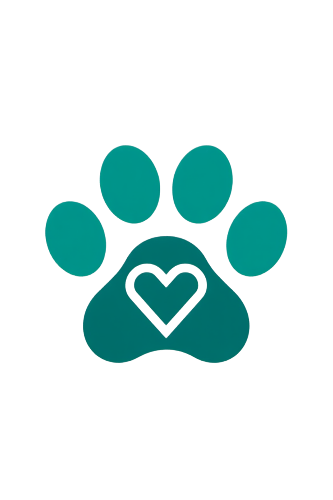

# 🐾 PetPrev — Plataforma de Saúde Preventiva Veterinária Domiciliar

<p align="center">
  
</p>

<p align="center">
  <strong>Cuidado veterinário preventivo contínuo, no conforto do lar, movido a tecnologia e rigor clínico.</strong>
</p>

<p align="center">
  
  
  
  
  
  
  
  
</p>

---

## 📖 Visão Geral

A **PetPrev** é uma plataforma digital de saúde preventiva veterinária por assinatura mensal recorrente (B2C), conectando tutores a médicos-veterinários credenciados para atendimento domiciliar preventivo.

### Principais Diferenciais & Módulos
- ❄️ **Trava Térmica & Cadeia de Frio (2°C a 8°C):** Auditoria contínua da temperatura das caixas térmicas biológicas com bloqueio automático em caso de desvio.
- 📋 **Prontuário Digital Imutável:** Histórico médico com modelo Append-Only, assinatura digital do RT/Veterinário e validação do tutor.
- 💉 **Motor Determinístico de Protocolos Vacinais:** Vacinação e vermifugação automatizadas e parametrizadas por espécie, idade e peso.
- 🗺️ **Roteamento Inteligente & Geo-Alocação:** Agrupamento e otimização de rotas diárias com Uber H3 e cálculo de score ponderado.
- 📴 **Operação Offline-First:** O app do veterinário funciona sem sinal de internet em campo, sincronizando automaticamente ao reconectar.

---

## 🌐 MVP Publicado

> **TODO:** adicionar aqui a URL pública do MVP em produção (ex.: `https://petprev.exemplo.com.br`).

---

## 🚀 Opção 1: Demonstração Rápida (Sem Instalar Nada)

Se você quer apenas conhecer o visual e navegar pelas telas do sistema já publicadas, acesse os repositórios dos front-ends construídos no Lovable:

- 🖥️ **Painel Web de Gestão / Admin:** [paw-map-dash](https://pet-prev-test.vercel.app/)
- 📱 **Aplicativo Mobile (Tutor & Veterinário):** [vet-home-care-sync](https://pet-prev-test-bewj.vercel.app/)

---

## 💻 Opção 2: Como Rodar o Projeto Localmente

Siga o passo a passo abaixo para rodar toda a stack do PetPrev (Banco de Dados + Backend NestJS + Admin Web + App Mobile) na sua máquina.

### Pré-requisitos
- [Node.js](https://nodejs.org/) (versão 20 ou superior)
- [Docker & Docker Compose](https://www.docker.com/) (para PostgreSQL, Redis e MinIO)
- [Git](https://git-scm.com/)

---

### Passo 1: Clonar o Repositório

```bash
git clone https://github.com/Alexlanprog/Petprev.git
cd Petprev
```

---

### Passo 2: Configurar Variáveis de Ambiente

O projeto usa um arquivo `.env` para configurar banco de dados, Redis, storage, autenticação e integrações externas. O arquivo de exemplo está na raiz do repositório, mas o backend (NestJS) procura o `.env` a partir do diretório onde é executado (`backend/`) — copie para lá:

```bash
cp .env.example backend/.env
```

Os valores padrão do `.env.example` já funcionam para rodar o projeto localmente com o `docker-compose.yml` fornecido — não é obrigatório alterar nada para subir o ambiente de desenvolvimento. Ainda assim, vale entender o que cada bloco de variáveis controla:

| Variável | Obrigatória? | Descrição |
| :--- | :--- | :--- |
| `NODE_ENV` | Sim | `development` habilita o `DevModule` (seed de contas de teste); em `production` esse módulo fica desabilitado. |
| `PORT`, `API_PREFIX`, `APP_URL`, `CORS_ORIGINS` | Sim | Porta e prefixo da API, URL pública do backend e origens permitidas por CORS. |
| `POSTGRES_HOST`, `POSTGRES_PORT`, `POSTGRES_DB`, `POSTGRES_USER`, `POSTGRES_PASSWORD`, `DATABASE_URL` | Sim | Conexão com o PostgreSQL 16 + PostGIS subido pelo Docker Compose. |
| `REDIS_HOST`, `REDIS_PORT`, `REDIS_PASSWORD`, `REDIS_URL` | Sim | Conexão com o Redis usado para cache, filas BullMQ e rate-limiting de OTP. |
| `MINIO_ENDPOINT`, `MINIO_PORT`, `MINIO_CONSOLE_PORT`, `MINIO_ROOT_USER`, `MINIO_ROOT_PASSWORD`, `MINIO_USE_SSL`, `MINIO_PUBLIC_URL` | Sim | Credenciais e endpoint do MinIO (armazenamento compatível com S3) usado para fotos, assinaturas e documentos. |
| `MINIO_BUCKET_COLDCHAIN`, `MINIO_BUCKET_RECORDS`, `MINIO_BUCKET_CARTEIRAS`, `MINIO_BUCKET_AVATARS` | Sim | Nomes dos buckets criados automaticamente no MinIO para cada tipo de arquivo. |
| `JWT_ACCESS_SECRET` | **Sim** | Segredo de assinatura do token de acesso. **O backend recusa iniciar se essa variável não estiver definida ou tiver menos de 32 caracteres.** |
| `JWT_ACCESS_EXPIRES_IN` | Sim | Tempo de expiração do token de acesso (ex.: `15m`). |
| `JWT_REFRESH_SECRET` | **Sim** | Segredo de assinatura do token de refresh. **Mesma validação obrigatória de 32+ caracteres no boot.** |
| `JWT_REFRESH_EXPIRES_IN` | Sim | Tempo de expiração do token de refresh (ex.: `7d`). |
| `OTP_TTL_SECONDS`, `OTP_COOLDOWN_SECONDS`, `OTP_MAX_ATTEMPTS` | Sim | Parâmetros do login passwordless via código OTP (SMS/WhatsApp). |
| `EVOLUTION_API_URL`, `EVOLUTION_API_KEY`, `EVOLUTION_INSTANCE_NAME` | Opcional | Integração com a Evolution API para envio de WhatsApp. Sem credenciais reais, o envio fica simulado (log local). |
| `LIVEKIT_URL`, `LIVEKIT_API_KEY`, `LIVEKIT_API_SECRET`, `LIVEKIT_ROOM_DURATION_MINUTES`, `LIVEKIT_RECORDING_ENABLED` | Opcional | Credenciais do LiveKit para teleorientação por vídeo. **Sem credenciais válidas, o sistema cai automaticamente no fallback `mvp_fallback` (link Jitsi Meet)** — nenhuma funcionalidade quebra. |
| `ASAAS_API_URL`, `ASAAS_API_KEY` | Opcional | Credenciais da API do gateway de pagamento Asaas (sandbox por padrão). |
| `ASAAS_WEBHOOK_TOKEN` | Recomendado | Token usado para validar a autenticidade dos webhooks de pagamento recebidos do Asaas. Sem ele configurado corretamente em ambos os lados (Asaas + `.env`), o webhook rejeita as notificações. |
| `BACKUP_DIR`, `BACKUP_S3_REMOTE`, `BACKUP_RETENTION_DAYS` | Não (só produção) | Parâmetros do script de backup offsite (`scripts/backup-offsite.sh`); não são usados no fluxo de desenvolvimento local. |

> ⚠️ **Atenção:** sem o `.env` configurado (ou sem `JWT_ACCESS_SECRET`/`JWT_REFRESH_SECRET` com pelo menos 32 caracteres), o comando `npm run start:dev` do backend falha imediatamente no boot com o erro `Configuração Inválida: JWT_ACCESS_SECRET é obrigatório e deve ter no mínimo 32 caracteres.` — essa validação existe de propósito, para impedir que o backend suba com segredos fracos ou ausentes.

---

### Passo 3: Subir a Infraestrutura (Banco de Dados, Redis e MinIO)

Inicie os contêineres essenciais em segundo plano:

```bash
docker compose up -d postgres redis minio
```

> **Verificar status dos serviços:**
> ```bash
> docker compose ps
> ```

---

### Passo 4: Iniciar o Backend (NestJS)

Abra um terminal e entre na pasta do backend:

```bash
cd backend
npm install
npm run start:dev
```

O servidor NestJS iniciará em: **`http://localhost:3000/api/v1`**.

---

### Passo 5: Iniciar o Painel Administrativo Web (`frontend-web`)

Abra um segundo terminal e execute:

```bash
cd frontend-web
npm install
npm run dev
```

Acesse o painel no navegador: **`http://localhost:5173`**

**Telas disponíveis no Admin:**
- `/` — Dashboard de operações, métricas e atendimentos do dia.
- `/mapa` — Visualização em mapa das rotas e veterinários em trânsito.
- `/auditoria` — Auditoria clínica de prontuários, divergências e conformidade da trava térmica.

---

### Passo 6: Iniciar o Aplicativo Mobile / Tutor & Vet (`frontend-mobile`)

Abra um terceiro terminal e execute:

```bash
cd frontend-mobile
npm install
npm run dev
```

Acesse a aplicação no navegador: **`http://localhost:5174`**

> 💡 **Dica de Visualização Mobile:**  
> No Google Chrome ou Microsoft Edge, pressione `F12` e clique no ícone de smartphone (**Toggle Device Toolbar** ou `Ctrl + Shift + M`) para simular a tela de um iPhone ou Android.

**Telas disponíveis no App:**
- `/` — Fluxo de atendimento do veterinário em campo.
- `/caixa-termica` — Controle de temperatura da caixa biológica de vacinas.
- `/prontuario` — Registro de exame físico, aplicação de vacinas e assinatura.
- `/tutor` — Hub principal do tutor.
- `/tutor/pets` — Carteira de vacinação e cadastro dos pets.
- `/tutor/agenda` — Solicitação e agendamento de consultas domiciliares.
- `/tutor/assinatura` — Gerenciamento do plano de assinatura e cobrança.

---

## 🌐 URLs e Portas dos Serviços Locais

| Serviço | URL Local | Descrição |
| :--- | :--- | :--- |
| **Admin Web (Dashboard)** | `http://localhost:5173` | Painel de controle do RT e administradores |
| **Mobile App (Tutor & Vet)** | `http://localhost:5174` | Web/PWA responsivo para tutores e veterinários |
| **API Backend (NestJS)** | `http://localhost:3000/api/v1` | API REST e regras de negócio |
| **MinIO Console (Storage)** | `http://localhost:9001` | Painel de controle de arquivos/S3 local |
| **MinIO API (Storage)** | `http://localhost:9000` | Endpoint de upload de imagens e exames |
| **PostgreSQL 16 + PostGIS**| `localhost:5432` | Banco de dados relacional e geoespacial |
| **Redis** | `localhost:6379` | Cache, filas BullMQ e rate-limiting |

---

## 🔑 Contas de Teste (Seeds)

O banco de dados de desenvolvimento possui registros iniciais pré-configurados em `database/seeds/001_initial_seed.sql`:

| Perfil | E-mail / Usuário | Telefone (OTP) | Descrição |
| :--- | :--- | :--- | :--- |
| **Administrador Geral** | `admin@petprev.com.br` | `+5511999990001` | Gestão de clínicas, rotas e financeiro |
| **Responsável Técnico (RT)** | `rt.veterinario@petprev.com.br` | `+5511999990002` | Auditoria de prontuários e aprovação de protocolos |
| **Veterinário de Campo** | *Criado via onboarding* | — | Acesso à caixa térmica, rotas e prontuário |
| **Tutor** | *Criado via app* | — | Gestão de pets, vacinas e assinatura |

---

## 📁 Estrutura do Repositório

```text
Petprev/
├── backend/                  # Monólito Modular NestJS (TypeORM, BullMQ, Auth, GIS)
│   ├── src/                  # Módulos: auth, pets, vaccines, appointments, audit, etc.
│   └── test/                 # Testes unitários e end-to-end (Jest)
├── frontend-web/             # Painel Web Admin (React 19 + TanStack Start + Tailwind CSS v4)
│   └── src/routes/           # Rotas: index, mapa, auditoria
├── frontend-mobile/          # App Mobile Tutor & Vet (React 19 + TanStack Start + Radix UI)
│   └── src/routes/           # Rotas: tutor, agenda, pets, prontuario, caixa-termica
├── database/                 # Estrutura do PostgreSQL
│   ├── migrations/           # DDLs e triggers de imutabilidade de prontuário
│   └── seeds/                # Carga inicial de protocolos clínicos e usuários
├── docker/                   # Arquivos de configuração de containers (Nginx, MinIO, Postgres)
├── scripts/                  # Scripts de automação (smoke-test, backup, deploy)
├── docker-compose.yml        # Orquestração local dos serviços
├── PDD_PRD_PetPrev.md        # Especificação de Produto e Requisitos (PRD v4.3)
└── SDD_PetPrev_Software_Design_Document.md # Documentação de Arquitetura e Engenharia (SDD v3.0)
```

---

## 🧪 Testes e Qualidade

Para rodar os testes automatizados da aplicação:

```bash
# Testes do Backend (Unitários e E2E)
cd backend
npm run test
npm run test:e2e

# Validação de Build dos Front-ends
cd frontend-web && npm run build
cd frontend-mobile && npm run build
```

---

## 📚 Documentação Técnica Adicional

Para entender em profundidade o modelo de negócio, a arquitetura modular e os requisitos regulatórios (CFMV):
- [PDD / PRD PetPrev](PDD_PRD_PetPrev.md) — Documento de Definição de Produto e Regras Clínicas.
- [SDD PetPrev](SDD_PetPrev_Software_Design_Document.md) — Documento de Arquitetura de Software e Engenharia.
- [Roteiro de Execução](Roteiro_Execucao_PetPrev.md) — Fases de rollout, testes operacionais e homologação.

---

<p align="center">
  Desenvolvido com 💚 para transformar a saúde preventiva de cães e gatos.
</p>
